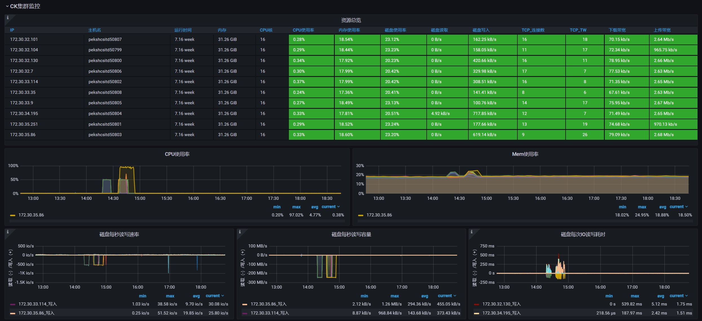
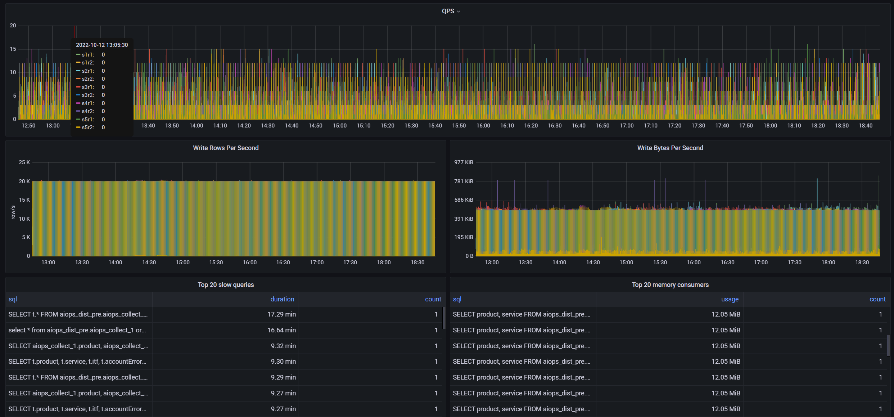
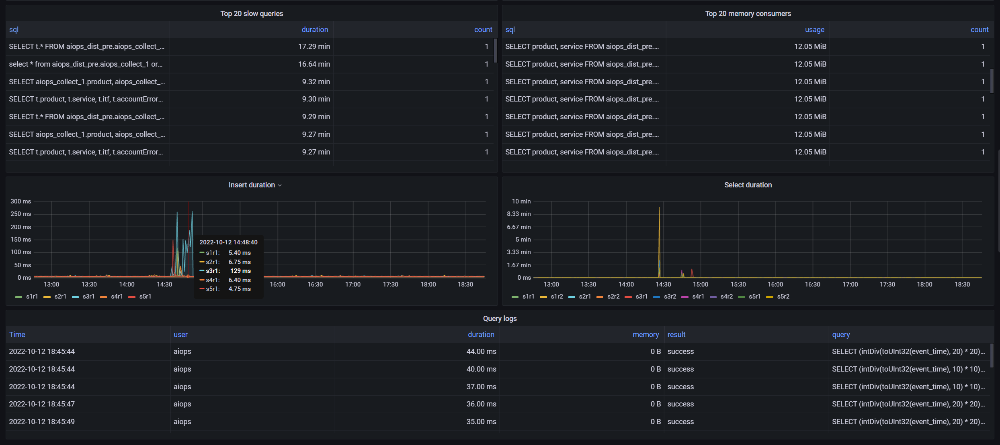
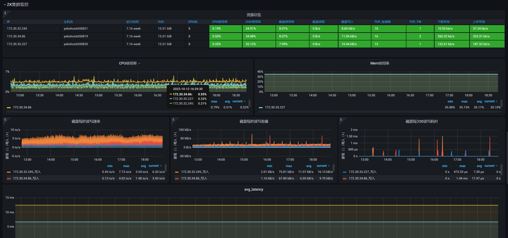
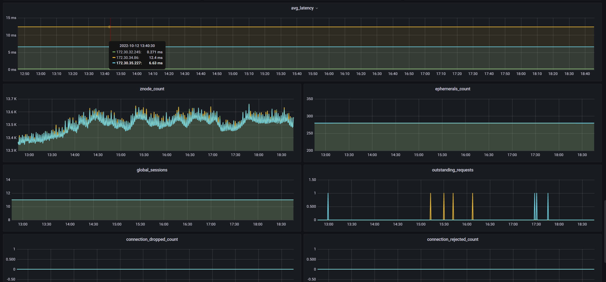
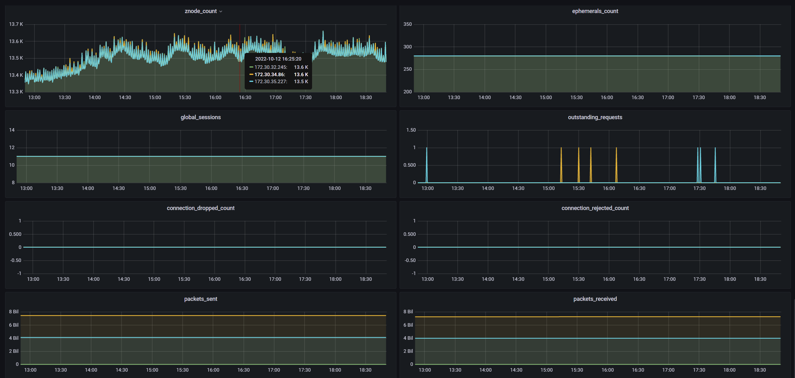

# 视觉盛宴














# 安装步骤

## 1、CH集群、ZK集群的每台机器都需要安装node_exporter

```sh
1、wget https://github.com/prometheus/node_exporter/releases/download/v1.4.0/node_exporter-1.4.0.linux-amd64.tar.gz

2、tar -zxvf node_exporter-1.4.0.linux-amd64.tar.gz

3、mkdir -p /opt/hihonor/node_exporter/

4、cd node_exporter-1.4.0.linux-amd64

5、cp node_exporter /opt/hihonor/node_exporter/

6、vim /usr/lib/systemd/system/node_exporter.service

[Unit]
Description=Prometheus Node Exporter
Documentation=https://prometheus.io/
After=network.target

[Service]
Type=simple
User=root
Restart=always
RestartSec=1
WorkingDirectory=/opt/hihonor/node_exporter/
ExecStart=/opt/hihonor/node_exporter/node_exporter

[Install]
WantedBy=multi-user.target

7、systemctl daemon-reload
8、systemctl enable node_exporter.service

9、开启服务：systemctl start node_exporter.service
10、查看服务是否正常启动：ss -lntp |grep 9100
```


## 2、Zookeeper配置文件中添加监控类配置（为Prometheus提供Zookeeper监控数据源）

```shell
官方文档：https://github.com/apache/zookeeper/blob/master/zookeeper-docs/src/main/resources/markdown/zookeeperMonitor.md#Prometheus

其中，主要是这个配置：metricsProvider.className=org.apache.zookeeper.metrics.prometheus.PrometheusMetricsProvider

配置完，需要重启zookeeper！
```


## 3、单独搞一台机器安装prometheus

```shell
1、wget https://github.com/prometheus/prometheus/releases/download/v2.38.0/prometheus-2.38.0.linux-amd64.tar.gz

2、tar -zxvf prometheus-2.38.0.linux-amd64.tar.gz

3、mv prometheus-2.38.0.linux-amd64 /opt/hihonor/prometheus

4、cd /opt/hihonor/prometheus

5、mkdir logs && mkdir data && mkdir rules && mkdir bin

6、mv prometheus bin && mv promtool bin

7、vim /lib/systemd/system/prometheus.service

[Unit]
Description=Prometheus
Documentation=https://prometheus.io/
After=network.target

[Service]
Type=simple
User=root
Restart=always
RestartSec=1
WorkingDirectory=/opt/hihonor/prometheus/
ExecStart=/opt/hihonor/prometheus/bin/prometheus --config.file=/opt/hihonor/prometheus/prometheus.yml

[Install]
WantedBy=multi-user.target
	
8、systemctl daemon-reload
9、systemctl enable prometheus.service

10、开启服务：systemctl start prometheus.service

11、查看服务是否正常启动：ss -lntp |grep 9090

12、通过界面看服务是否启动正常：http://ip:9090/

13、添加需要监控的任务：vim /opt/hihonor/prometheus/prometheus.yml

scrape_configs:
  - job_name: "ck_cluster_exporter"
    relabel_configs: 
      - source_labels: ['__address__']
        target_label: 'instance'
        regex: "(.*):(.*)"
        replacement: $1
        static_configs:
      - targets: ["ip:9100", "ip:9100", ...]
  - job_name: "zk_cluster_exporter"
    relabel_configs: 
      - source_labels: ['__address__']
        target_label: 'instance'
        regex: "(.*):(.*)"
        replacement: $1
        static_configs:
      - targets: ["ip:9100", "ip:9100", ...] 
  - job_name: "zk_cluster_monitor"
    relabel_configs: 
      - source_labels: ['__address__']
        target_label: 'instance'
        regex: "(.*):(.*)"
        replacement: $1
        static_configs:
      - targets: ["ip:7000", "ip:7000", ...]

14、wq && systemctl restart prometheus.service
```

我的配置（仅供参考）：

```shell
scrape_configs:
  - job_name: "ck_cluster_exporter"
    relabel_configs: 
      - source_labels: ['__address__']
        target_label: 'instance'
        regex: "(.*):(.*)"
        replacement: $1
        static_configs:
      - targets: ["172.30.32.104:9100","172.30.32.130:9100","172.30.35.251:9100","172.30.33.114:9100","172.30.35.86:9100","172.30.34.195:9100","172.30.33.9:9100","172.30.32.7:9100","172.30.32.101:9100","172.30.33.35:9100"]
  - job_name: "zk_cluster_exporter"
    relabel_configs: 
      - source_labels: ['__address__']
        target_label: 'instance'
        regex: "(.*):(.*)"
        replacement: $1
        static_configs:
      - targets: ["172.30.32.245:9100","172.30.35.227:9100","172.30.34.86:9100"]
  - job_name: "zk_cluster_monitor"
    relabel_configs: 
      - source_labels: ['__address__']
        target_label: 'instance'
        regex: "(.*):(.*)"
        replacement: $1
        static_configs:
      - targets: ["172.30.32.245:7000","172.30.35.227:7000","172.30.34.86:7000"]
```

  

## 4、grafana导入集监控面板

```shell
1、安装clickhouse数据源插件：https://grafana.com/grafana/plugins/vertamedia-clickhouse-datasource/

2、安装同比环比数据源插件：https://github.com/AutohomeCorp/autohome-compareQueries-datasource

5、配置clickhouse集群中直连各个节点的数据源，数据源命名规则：clickhouse-s1r1、clickhouse-s1r2...

3、配置同比环比数据源

4、配置prometheus数据源

6、导入Clickhouse-Cluster-Monitor-Dashboard.json面板
```


# 公众号

关注不迷路，微信扫描下方二维码关注公众号「**南山有一郎**」，时刻收听**项目更新**通知！

在公众号后台回复“**加群**”，即可加入「**南山有一郎**」交流群！


# 许可证

```
Copyright [2022] [xlvchao]

Licensed under the Apache License, Version 2.0 (the "License");
you may not use this file except in compliance with the License.
You may obtain a copy of the License at

    http://www.apache.org/licenses/LICENSE-2.0

Unless required by applicable law or agreed to in writing, software
distributed under the License is distributed on an "AS IS" BASIS,
WITHOUT WARRANTIES OR CONDITIONS OF ANY KIND, either express or implied.
See the License for the specific language governing permissions and
limitations under the License.
```
